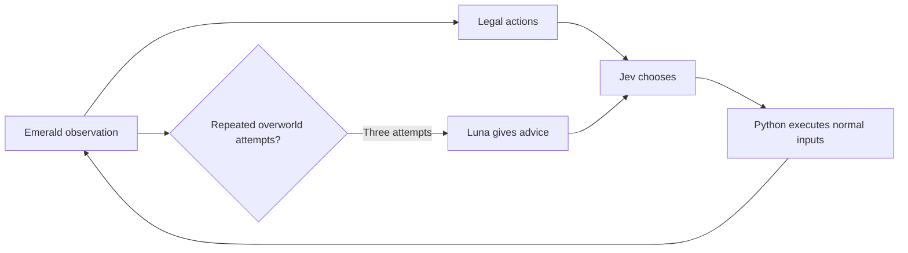

# Jev plays Emerald, with Luna as an occasional coach

The project is **Jev Plays Emerald**. Jev is the player: it chooses the starter,
navigation, interactions, healing and combat from a menu of mechanically legal
actions. Luna gives short corrections when overworld attempts repeat without
story progress. Python performs navigation and menu inputs, advances mandatory
dialogue, and verifies outcomes. This is structured-state play using game RAM,
not screenshot-only gameplay.

Luna cannot press buttons, choose a starter for Jev, remove alternatives, or
invent Jev probabilities. A hint must identify an offered action, give its
location, explain what to avoid, and name an observable success signal.
Stale advice is discarded but its tokens still count. A followed hint remains
useful across map transitions until story progress clears it.

## What changed

- Fixed loss recovery: upstream previously switched away from Jev after a
  whiteout. A real loss now heals the party and returns control to Jev.
- Fixed revisiting the clock: the existing-clock screen now closes normally
  instead of leaving the game with no legal action.
- Restricted Luna to controllable overworld decisions; it never interrupts a
  battle or blocking menu.
- Removed duplicated map tables and advice telemetry from prompts, cached
  static opening knowledge, and prevented overlapping viewer polls.
- Added bounded headless Codex coaching with saved ChatGPT authentication,
  explicit shutdown cleanup, and no automatic Luna API fallback.
- Added fresh-run comparisons, response-level usage accounting and faithful
  replay deduplication. Failed requests and missing usage remain visible.

The raw-map cleanup reduces serialized observation bytes by **20.8%** when
applied to the 63 recorded requests from the earlier grounded run. That is a
payload-size measurement, not a tokenizer measurement or a gameplay quality claim.
In two small live Codex probes, replacing generic coding context with short game
instructions reduced input from **12,248 to 3,715 tokens** (69.7%). These probes
are separate from the full game runs.

## Why Codex for Luna

For sparse coaching, a fresh bounded CLI call is simpler than a persistent
agent server and avoids carrying an ever-growing conversation. Jev remains the
fast action selector. Local configuration uses `JEV_PLANNER_BACKEND=codex` and
`JEV_PLANNER_MODEL=gpt-5.6-luna`.

This uses the existing ChatGPT/Codex subscription capacity rather than a separate
Luna API key. It is not free or unlimited compute. Jev still uses AI Gateway.
CLI prompt overhead appears in the token totals. Therefore these runs **cannot
answer exactly how many tokens a bare Luna API implementation would use**.
That would require a separate API experiment; no such paid Luna experiment was
run for this change. [Official Codex automation documentation](https://learn.chatgpt.com/docs/non-interactive-mode).

## Latest repeated evidence

The completed fixed-source suite recorded **5/5 hybrid wins**, **3/3 Luna-only
wins**, and **0/3** for each Jev control. Hybrid averaged 3.6 Luna calls and
148,281 known combined tokens per win, versus 38.7 Luna calls and 179,289
tokens for Luna-only. Two hybrid attempts recovered from losses. Six failed
hybrid Jev calls have unknown usage. See [all repeated results](reliability-results.md).
The earlier single-run figures below are development history, not the primary comparison.

## Earlier development measurements — 22 September 2026

All token totals below include returned stale work, and exclude usage the
provider did not report. They are known totals, not complete billing totals.
“Jev choices” counts accepted decisions; request counts can be higher due to
retries and stale responses.

| Configuration | Result | Jev choices | Luna calls | Known input | Known output | Wall seconds |
| --- | --- | ---: | ---: | ---: | ---: | ---: |
| Jev alone, no grounded brief | Stopped at 150 choices in opening houses | 150 | 0 | 213,851 | 11,551 | 121.95 |
| Jev with grounded facts/memory, no coach | Stopped at 150 choices in opening houses | 150 | 0 | 489,317 | 24,938 | 239.82 |
| Jev + Codex Luna, run 2 | Rival victory | 50 | 3 | 129,940 | 6,380 | 93.74 |
| Jev + Codex Luna, run 3 | Loss, normal recovery, rival victory | 69 | 4 | 189,124 | 9,739 | 121.34 |
| Codex Luna alone | Two losses, normal recovery, rival victory | — | 84 | 392,091 | 4,864 | 590.09 |

Luna-only made 83 accepted choices and one stale call. Its usage is complete
for this run: **396,955 total tokens**, including 3,584 cached input tokens
already inside the input count. Hybrid runs 2 and 3 recorded **136,320** and
**198,863** total tokens respectively—about **66% and 50% fewer known tokens**.
Hybrid failed-request usage is missing, so these percentages describe reported
totals, not exact billing savings. Luna-only used one-shot Codex, not a bare API
or an optimized persistent session. Different starter choices and RNG also
affected battles: Jev selected Treecko; Luna selected Mudkip.

The observed benefit was fewer expensive-model calls: **3–4 coach calls instead
of 84 Luna player calls**, while Jev retained every non-forced action. The
grounded control's failure gives some evidence that the corrective advice helped
resolve the clock loop beyond just supplying facts. One control run and two
later hybrid runs do not establish a general causal performance advantage.

Hybrid run 2 splits into **114,892 input / 5,933 output for Jev** and
**15,048 input / 447 output for Luna**. Two Luna responses were accepted and
one was stale. Four of Jev's 54 returned responses were stale; two additional
requests have unknown usage. Known Jev cost at the recorded rate: **$0.004825464**.

Hybrid run 3 splits into **168,342 input / 9,152 output for Jev** and
**20,782 input / 587 output for Luna**. Three Luna responses were accepted and
one was stale. Three of Jev's 72 returned responses were stale; three failed
requests have unknown usage. Luna reported 1,792 cached input tokens, already
included in the input total. Known Jev estimate: **$0.007070364**.

Both Jev-only controls have two requests with unknown usage. The grounded
control repeatedly tried leaving before setting the clock; Mom's script sent
the player upstairs again, making 143 responses stale. More context alone did
not resolve this loop in that run. This is a property of the tested prompts and
task, not a general statement about Jev's capabilities.

An earlier development hybrid also won: 54 Jev choices, 4 Luna calls, 155,056
known input / 7,359 output tokens, 125.27 seconds. It preceded the final prompt
cleanup and is recorded as development evidence rather than another identical
revision trial.

The loss-recovery fix was separately exercised from a real checkpoint with a
zero-token stub deliberately choosing Leer until a wild loss. Normal recovery
returned Jev home at full health after 2,774 frames. The clock fix closed the
actual stalled clock checkpoint in 34 frames. These probes are executor tests,
not fresh model-driven completions.

Local raw evidence is under `.cache/benchmark-{jev,hybrid,luna}-20260922-*`
and `.cache/benchmark-grounded-20260922-1`. Each includes the actual decisions,
summary, final screenshot and emulator state. The tracked benchmark script and
report command reproduce the workflow without committing ROMs or save files.

The early Luna pilot was manually stopped at 185 seconds because the missing
clock-close executor had stalled it after six choices. Its old summary says
`time-budget`; the actual stop was an operator interrupt, now correctly labeled
by newer harness versions. The later Luna run began a fresh New Game after the
fix. Early Jev pilot 1 stopped at 150 choices and used different failed-action
filtering; it is excluded from the main comparison.

The two later hybrid runs and all main-table controls disabled the same
failed-action filtering. The grounded control and later hybrid runs share the
same gameplay prompt compaction. Failure telemetry was improved during the
experiments: earlier unknown requests remain unknown; hybrid run 3 records
explicit request errors. Current harness versions separately preserve Luna's
reference-enriched provider requests; the completed Luna trial predates that
extra log and its reference facts are reproducible from the tracked knowledge
file and request states.

Across all eight new benchmark runs, including the failed pilots, recorded Jev
API estimates total **$0.057530634**. There may be additional charges for calls
whose usage was not returned. Luna ran through ChatGPT-authenticated Codex for
these new experiments; no separate Luna API calls were made. Subscription
capacity was consumed. Engineering-agent usage is not included in game logs.

Checks at that development stage: **229 Python tests + 7 ROM subtests**, TypeScript typecheck,
and **18 service tests** pass. Two existing aiohttp test-helper deprecation
warnings remain. This verifies the tested opening and failure paths; it does
not prove every part of the codebase is maximally optimized.

## Suggested post draft

I built Jev Plays Emerald. Jev chooses the starter, navigation, healing and
battle actions; Python turns those choices into normal game inputs.

Jev sometimes repeated legal actions without advancing the story. I added Luna
as an occasional coach: after repeated attempts, it gives a short correction.
Jev still makes the next choice, and Luna has a strict call limit.

In a fresh 14-attempt comparison, Jev plus Luna completed the first rival battle
in all five attempts. Two lost a battle, recovered normally, and came back to
win. Jev alone—and Jev with the same grounded facts but no coach—each finished
0/3 within the 150-choice limit. Luna playing alone finished 3/3.

The hybrid averaged 3.6 Luna calls per win, versus 38.7 when Luna played alone.
Combined reported tokens averaged 148k versus 179k, about 17% lower. Six failed
hybrid calls had unknown usage, so that is not an exact billing comparison.
The sample is small, and game randomness and network timing varied.

For this local version, Luna runs through headless Codex using my ChatGPT
subscription; Jev still uses its API. This consumes subscription capacity and
is not a bare Luna API benchmark. The useful result: a handful of corrections
helped Jev finish the milestone while remaining the player.

## Interpretation rules for the post

Count every returned model response, including discarded stale work. Do not add
the selected-decision records again. Missing/error usage is unknown, not zero.
Cached input is included in input totals. Jev prices are recorded estimates;
Luna tokens must never be multiplied by Jev's price.

The ungrounded Jev-only arm differs in reference knowledge as well as coaching.
The grounded Jev control gets the same facts/memory as the hybrid without Luna
calls. Runs use the same legal actions and executors, fresh profiles and ledgers,
but game RNG and network timing differ. They ran concurrently, so wall times are
observations rather than a controlled throughput comparison.

These are small experiments about this opening slice. Avoid claims that Jev is
generally incapable of long-term decisions, that the hybrid always beats Luna,
or that this measures exact API savings. The defensible question is whether
occasional advice helped this system finish a real game milestone while keeping
Jev in control.
